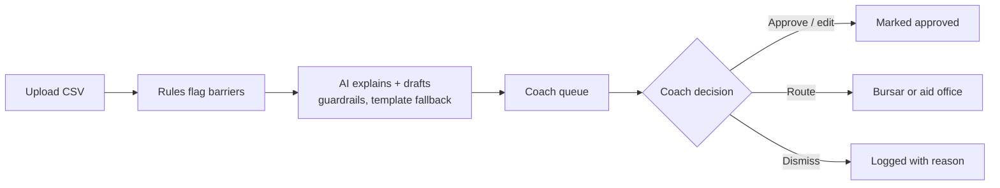

# My Path

[](https://github.com/kgervin/my-path/actions/workflows/ci.yml)
[](LICENSE)
[](https://github.com/kgervin/my-path/actions/workflows/codeql.yml)

My Path helps ASU Online success coaches find students with **small, fixable barriers**
(holds, small balances, failed payments, missing aid documents) **before the drop date**.
It explains each barrier in plain words and drafts outreach that a coach approves, edits, routes
or dismisses.

> **Synthetic data only.** My Path sends no real messages and uses no real student data.
> A human approves every message.

## How it works



- **Rules decide, the AI only explains.** Six deterministic, unit-tested barrier rules with
  thresholds in config. Recall on seeded barriers is tested at 100%.
- **Guardrails on every draft:** under 120 words, grade 8 reading level or lower, greets the
  student by name, one action, no shaming or risk language, and cites only the flagged fields.
  Any failure falls back to a reviewed template.
- **Coach workflow:** urgency-sorted queue, filters in the URL, approve, edit, route or dismiss
  (with a reason), Undo, English/Spanish redraft, full action log, and optimistic locking so two
  coaches never overwrite each other.

| PRD requirement | Where |
| --- | --- |
| FR-1 CSV upload + column validation | `services/ingestion.py`, `features/upload` (checked before upload too) |
| FR-2 Deterministic rules + days to drop | `domain/rules.py` |
| FR-3/4 Explanation + outreach draft | `services/drafting/*` |
| FR-5 Queue sorted by urgency | `persistence/repository.py`, `features/queue` |
| FR-6 Approve / edit / dismiss / route | `services/review.py`, `features/detail` |
| FR-7 Counters | `components/Counters.tsx`, `/runs/{id}/summary` |
| FR-8 Action log with before/after text | `ActionLogRow`, `ActionHistory.tsx` |
| FR-9 English/Spanish + tone | `redraft` action, `DraftEditor.tsx` |
| FR-10 Filters | `FlagQuery`, `QueueFilters.tsx` |

## Quick start

Requirements: Python 3.12+ with [uv](https://docs.astral.sh/uv/), Node 22+.

```bash
make install
make api      # http://localhost:8000/docs
make web      # http://localhost:5173
```

On the Upload page, choose **Download a sample CSV** (200 synthetic students), then upload it.

Production-like stack with Docker: `make up`, then open http://localhost:8080. Add
`--profile observability` for Prometheus (:9090) and Grafana (:3000).

To draft with Claude instead of templates, set `MY_PATH_DRAFTER=anthropic` and
`ANTHROPIC_API_KEY`. For a pilot, point this at an ASU-approved endpoint that does not
retain data.

## Repository layout

```
backend/     FastAPI API: domain (rules), services, persistence, API, migrations
frontend/    React + TypeScript SPA, mobile-first, WCAG 2.2 AA
deploy/k8s/  Kustomize base + staging/production overlays
ops/         Prometheus SLO rules + alert tests, Grafana dashboard
docs/        Architecture, ADRs, SRE (SLOs, runbook, incidents), UX and accessibility
```

## Quality gates (CI)

| Gate | Tooling |
| --- | --- |
| Lint / format / types | ruff, mypy `--strict`, oxlint (incl. jsx-a11y), Prettier, `tsc --strict` |
| Tests | pytest (≥90% coverage), Vitest + Testing Library (≥80%) with axe on every page |
| End to end | Playwright on phone + desktop, axe WCAG 2.2 AA scan, no horizontal scroll |
| Schema | `alembic check` fails if models and migrations drift |
| Security | gitleaks, pip-audit, npm audit, Trivy image scan, hadolint; CodeQL when the repo is public or `CODE_SCANNING_ENABLED=true` (needs GitHub Code Security on private repos) |
| Infra | kubeconform on rendered manifests, `promtool` rule checks and alert unit tests |
| Supply chain | Dependabot, SBOM + provenance, cosign-signed images, digest-pinned deploys |

## Documentation

- [Architecture](docs/architecture.md) and [decision records](docs/adr)
- [SLOs](docs/sre/slos.md) · [Runbook](docs/sre/runbook.md) · [Incident response](docs/sre/incident-response.md) · [Error budget policy](docs/sre/error-budget-policy.md)
- [Nielsen's 10 heuristics in My Path](docs/ux/nielsen-heuristics.md) · [Accessibility](docs/accessibility.md)
- [Contributing](CONTRIBUTING.md) · [Security](SECURITY.md)

## License

[MIT](LICENSE) © 2026 Gervin Kahunde
