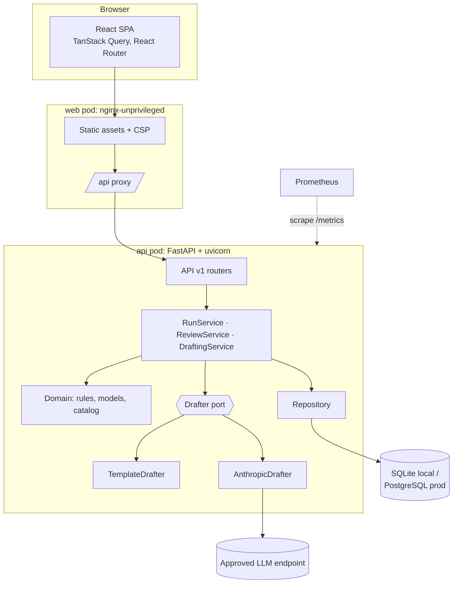

# Architecture

## Layers (backend)

| Layer | Package | Depends on | Notes |
| --- | --- | --- | --- |
| Domain | `my_path.domain` | nothing | Pure dataclasses and rule functions. No I/O. |
| Services | `my_path.services` | domain, persistence | Use cases: ingest, flag, draft, review. |
| Persistence | `my_path.persistence` | domain | SQLAlchemy 2 async ORM + repository. |
| API | `my_path.api` | services | Thin HTTP adapters, schemas, RFC 9457 errors. |
| Composition | `my_path.container`, `main` | all | The only place that picks implementations. |

Dependencies point inward. The drafter is a port (`Drafter` protocol), so the LLM vendor can be
swapped without touching services or tests.

## Request lifecycle: a run

1. `POST /api/v1/runs` validates the CSV (every error reported at once), runs the rules and
   stores flags in one transaction, then returns **202** with `status=processing`.
2. A background task drafts each flag with bounded concurrency
   (`MY_PATH_LLM_MAX_CONCURRENCY`). Every draft passes guardrails or falls back to a template.
   Progress is committed per flag.
3. The UI polls `GET /runs/{id}` and shows "Writing drafts: n of m".
4. On startup the API resumes any run left in `processing`, so a restart never strands a run.

## Scaling path

| Now (MVP) | When load grows |
| --- | --- |
| In-process background task | Move `draft_run` to a queue worker (e.g. arq/Celery + Redis). The service API does not change. |
| SQLite locally, PostgreSQL in k8s | Add read replicas; flag list queries are indexed by `(run_id, days_to_drop)` and `(run_id, status)`. |
| Barrier filter in Python over JSON | Move barrier types to a join table, or a GIN index on PostgreSQL. |
| HPA on CPU | Add HPA on request rate or queue depth via Prometheus Adapter. |
| Stateless API pods | Already stateless: the coach name is client-side, state lives in the database. |

## Concurrency and consistency

- Optimistic locking: every flag has a `version` (SQLAlchemy `version_id_col`). Actions must send
  the version the coach saw; a mismatch returns **409** and the UI offers "Load the latest
  version".
- All state transitions go through `ReviewService._apply` (one state machine); invalid
  transitions return **422** with a plain-language reason.
