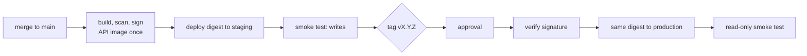

# Deploying on Render (free) with Neon: staging and production

Everything runs on free tiers with no credit card. The pipeline **builds once and promotes the
same artifact**: the API image that is scanned and signed is exactly what runs in staging, and
later in production. Nothing is rebuilt between environments.

| | Staging | Production |
| --- | --- | --- |
| Web | `my-path-web-staging` (static, builds from `main`) | `my-path-web` (static, builds from `release`) |
| API | `my-path-api-staging` (prebuilt image) | `my-path-api` (prebuilt image) |
| Database | Neon branch `staging` (schema only, no production data) | Neon branch `production` |
| Deployed when | every green commit on `main` | a `vX.Y.Z` tag, after your approval |
| Verified by | smoke test incl. upload, draft, approve, undo | read-only smoke test |



Free-tier notes: services sleep after 15 minutes idle (the first request takes ~30–60 s; the
smoke test waits up to 10 minutes). The workspace gets 750 instance-hours a month: four mostly
idle services fit easily, but two APIs awake around the clock would not.

## One-time setup

Order matters: the images must exist and be public before Render can pull them.

1. **Make the API image public** (the repo is public; Render then pulls without credentials).
   GitHub → your profile → **Packages** → `my-path-api` → **Package settings** →
   **Change visibility** → Public.
2. **Create the `release` branch** at the commit production runs today (the Release workflow
   moves it from then on):
   `git push origin origin/main:refs/heads/release`
3. **Sync the Blueprint**: Render → Blueprints → `my-path` → **Sync**. It creates the two staging
   services and switches `my-path-api` to the prebuilt image.
   - If Render refuses to change `my-path-api`'s runtime in place, delete that one service and
     sync again (production only has synthetic data; the database is unaffected).
4. **Database URLs** (each API → **Environment** → `MY_PATH_DATABASE_URL`):
   production keeps its current value; staging gets the Neon `staging` branch's direct
   connection string in the same format: `postgresql+asyncpg://…?ssl=require`, no `-pooler`.
5. **Deploy hooks**: for each API, **Settings → Deploy Hook → copy**, then store it on the
   matching GitHub environment (the value is a secret, so paste it at the prompt):
   ```bash
   gh secret set RENDER_DEPLOY_HOOK_API --env staging -R kgervin/my-path
   gh secret set RENDER_DEPLOY_HOOK_API --env production -R kgervin/my-path
   ```
6. **Turn deploys on**: `gh variable set RENDER_DEPLOY_ENABLED --body true -R kgervin/my-path`

## Everyday use

- **Ship to staging**: merge a PR. Release builds, deploys to staging and runs the smoke test.
- **Ship to production**: tag a commit on `main` that passed staging, then approve the run.
  ```bash
  git tag v0.2.0 origin/main && git push origin v0.2.0
  ```
- **Roll back production**: open the previous tag's Release run → re-run **Deploy to production**.
  It redeploys that tag's digest and moves `release` back. Migrations are expand-then-contract
  (see the runbook), so the previous version runs against the current schema.
- **Check what is live**: `curl https://my-path-api.onrender.com/healthz` returns the commit.

## Troubleshooting

| Symptom | Fix |
| --- | --- |
| "RENDER_DEPLOY_HOOK_API is not set" | Step 5: the secret belongs to the GitHub *environment*, not the repo. |
| Render deploy fails pulling the image | Step 1: the `my-path-api` package must be public (or add a GHCR credential in Render). |
| Smoke test times out waiting for the release | Render deploy failed. Open the service's **Events**; usually `MY_PATH_DATABASE_URL`. |
| "No image for <sha>" on a tag | The tagged commit never finished Release on `main`. Tag a commit that passed staging. |
| `cosign verify` fails | The image wasn't built by this repo's `_image.yml` on `main`. Don't deploy it. |
| Intermittent `prepared statement ... does not exist` | The URL uses Neon's pooled host (`-pooler`). Use the direct host. |
| UI shows "Connection problem" | The API is waking up (wait a minute) or the `/api/*` rewrite points at the wrong service. |
