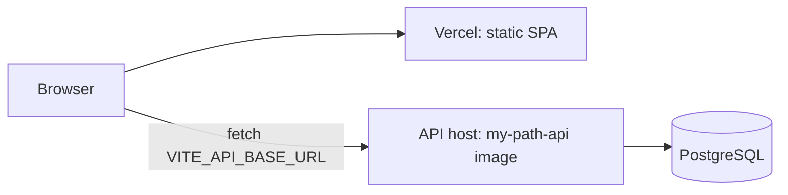

# Deploying the frontend on Vercel

Vercel hosts **only the frontend** (a static Vite build). The FastAPI backend runs elsewhere,
from the `my-path-api` image the Release workflow publishes, on any container host with
PostgreSQL. It needs a background task and a persistent database, so it is not a fit for
serverless functions.



## One-time Vercel setup

1. **Keep one project.** Delete the duplicate project in Vercel (Project → Settings → General →
   Delete Project) so each push builds once.
2. In the remaining project, go to **Settings → Build and Deployment → Root Directory** and set it
   to `frontend`. `frontend/vercel.json` supplies the framework, build and install commands, the
   output folder, security headers, asset caching and the fallback that makes refreshed pages
   (such as `/queue`) load the app instead of returning 404.
3. **Settings → Environment Variables**: add `VITE_API_BASE_URL`, for example
   `https://api.your-host.example/api/v1`, for Production (and Preview if previews should use it).
   It is read at build time, so **redeploy** after changing it.
4. Optional: **Settings → Git → Ignored Build Step** with
   `git diff --quiet HEAD^ HEAD -- .` skips Vercel builds when a commit does not touch `frontend/`.

## Backend settings for a separate origin

On the API host, allow the Vercel origins (the regex covers per-deploy preview URLs):

```bash
MY_PATH_CORS_ORIGINS='["https://kgervin-my-path.vercel.app"]'
MY_PATH_CORS_ORIGIN_REGEX='^https://kgervin-my-path(-[a-z0-9-]+)?\.vercel\.app$'
MY_PATH_ENVIRONMENT=production
MY_PATH_DATABASE_URL=postgresql+asyncpg://…
```

Run `alembic upgrade head` against the database before the first start (the container image
includes Alembic: `docker run … my-path-api alembic upgrade head`).

## Checking a deployment

- The Upload page loads, and refreshing `/queue` still shows the app (not a 404).
- **Download a sample CSV** works, which proves the UI can reach the API.
- In DevTools → Network, API calls go to `VITE_API_BASE_URL` and return 200 with an
  `X-Request-ID` header.

If the UI shows "Connection problem", the API is unreachable or CORS is rejecting the origin.
Check `MY_PATH_CORS_ORIGINS` / `MY_PATH_CORS_ORIGIN_REGEX` on the API.
